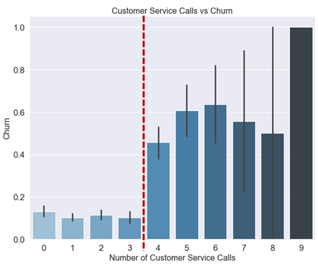

# Customer Churn Analysis

## Overview

This is the **third end-of-module project in the Flatiron Online Data Science Course**. The project aims at testing and reinforcing the fundamental Machine Learning concepts taught in phase 3 of the Flatiron School curriculum.

**Deliverables** for this project are this [GitHub Repository](https://github.com/senseize/Customer-Churn-Analysis), a [Jupyter Notebook](./SyriaTel_Customer_Churn.ipynb) containing the code along with markup, as well as a [presentation](./Customer-Churn-Analysis.pdf).

## Business Problem

The task at hand is to **build a classifier for the telecom business of SyraTel**, to enable the company to **reliably predict customer churn** and hence focus on retainable consumers.

This is a **binary classification problem** (i.e. will the client be lost, yes or no?), trying to determine the churn via underlying patterns of customer data.

## Data & Methodology

The dataset provided is the **Churn in Telecom's dataset** from [Kaggle](https://www.kaggle.com/datasets/becksddf/churn-in-telecoms-dataset).

I opted for the OSEMiN approach, beginning with obtaining, scrubbing and exploring the data, before building models that enable predictions of customer churn. 

## Results / Key findings

**Region**
 - The Northeastern region of the US exhibits the highest rate of customer churn in the SyraTel dataset
 - The lowest customer churn is present in midwestern states
 


**Total Charge**
 - The level of Total charge has a clear effect on the likelihood of customer churn
 


**Customer Service Calls**

 - The more customer service calls a customer makes, the more likely it is for the customer to churn
 - Customer churn strongly increases after customers have made 4 service calls
 


**International Plan**
 - Customer churn is less likely im case of the presence of an international plan
 


## Model Overview

Below is an overview of the various models built for this project and their respective performance with regards to **Training set**, **Test set**, **Precision**, **Recall** and **F-1 score**:


## Conclusions & Actionable Insights

1. Focus on lower pricing or cost benefits such as discounts
2. Ensure higher quality customer service, reaching a benign solution for the customer after three customer service calls in order to avoid an increased potential for churn
3. Focus analytical efforts on the international plan as it has been shown that it has a strong influence on whether or not a customer is retained. Possible aspects to investigate are availability (churn is reduced among customer with international plans) and pricing (more affordable international plans might increase its presence, thus reducing customer churn).

## Contact Information

For any questions, please contact me at **kontakt@oliverzimmer.eu**

## Repository Structure

```
├── data
├── images
├── CONTRIBUTING.md
├── Customer-Churn-Analysis.pdf
├── LICENSE.md
├── README.md
└── SyriaTel_Customer_Churn.ipynb
```
